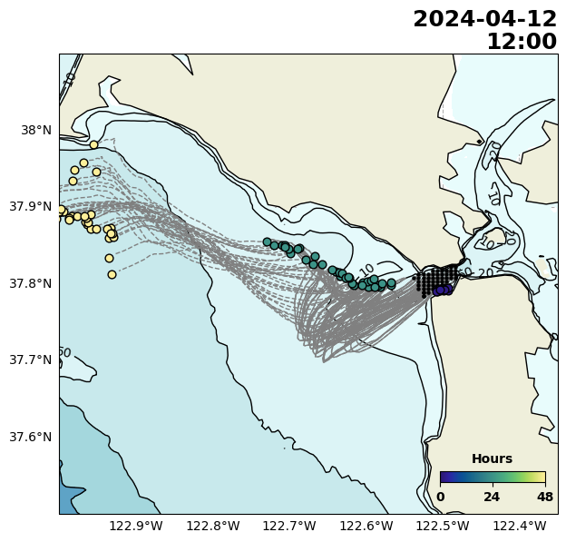

# San Francisco Bay Plume Tracker #

## Background ##
The outflow plume the SF Bay has is known to transport pollutants to nearshore environments North and South of the golden gate. This model uses 2 km surface current vectors maps generated from High Frequency Radar (HFR) to forward project the trajectory of the SF outflow destination. This code uses [OpenDrift](http://opendrift.github.io) python software package for particle trajectory modeling.

---

